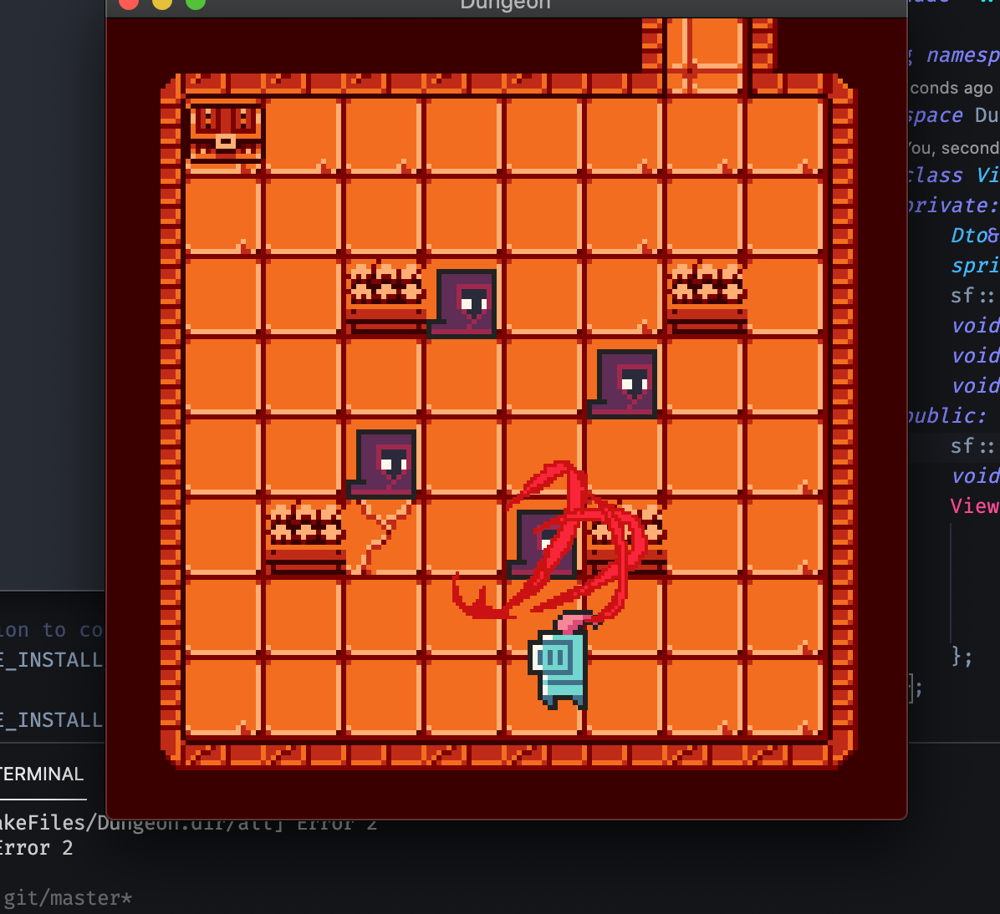
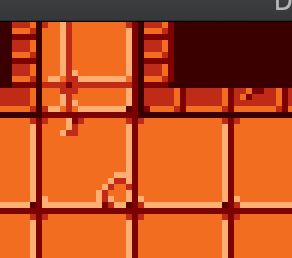

# Dungeon
<div style="text-align:center">Little game creator, DS-OOP Course project; <br>
Done by 109550185, 李佳駿</div>


## Play

Running these command on terminal to play game! (on OS X)

```shell
cd <build directory>
./Dungeon
```

## Feature

- **Customizability**: **Dungeon** is techically not a game, but a game creator, create games by reading a JSON file, providing extreme flexibility and inifinte possibilities;
  - To customize your own game, modify ``res/game.json`` in correct syntax and create your own map in **[Tiled](https://www.mapeditor.org/)**.
- **Save**: Press B to save the game in ``save.json``, the program will read the ``save.json`` file as its game rather than ``res/game.json`` when ``save.json`` exists;
- **Move**: use WASD to move;

- **Attack**: attacking and being attacked;

  

  - Press J to attack enemy or npc;
  - enemy attacks player when player get closed to them. after every attacks, terminal will display the current status of player ( hp and armor );

- **Dialog**: conversation from npc or getting notice of winning game or getting item;

- **Treasures**: player can get items in these chest box by getting close to them; 

   

- **Portals**: player steping in these tunnels will be teleported to other rooms;

- **Status**: show status by pressing P 

## Dependencies

Library used for the project:

- **[nlohmann/json](https://github.com/nlohmann/json) **: json processor for file reading and file saving; 
- **[SFML](https://www.sfml-dev.org/)** : Simple and Fast Multimedia Library, the library that used for graphics for this project, compiling SFML is recommended before development due to version and compiler compatibility;

### Runtime dependencies

There's two type of runtime dependencies, assets and game files.

- Assets: game assets include image of map tile, player, monster, npc, as well as the file defined the map; missing ***ANY*** of them may cause the game to ***CRASH***;
- Game file: ``res/game.json`` or ``save.json`` missing both of them or havinig invalid syntax will cause the game to ***CRASH***;

## Game.json syntax

Creating game for **Dungeon** have to follow the correct syntax:

```json
{
  "player":{
    <attributes of player>
  },
  "room_list":[
    <room>, <room>, ...
  ],
  "items":[
    <item>, <item>, ...
  ]
}
```

*attribute of player*:

| Attribute    | Explanation                                  |
| ------------ | -------------------------------------------- |
| room         | current room that player at                  |
| x            | Position                                     |
| y            | position                                     |
| hp           | health point                                 |
| armor        | damage player taken will be reduced by armor |
| attack_speed | maximum attack amount of a second            |
| inventory    | array of integer index of items              |

*room*:

| Attribute | Explanation                                          |
| --------- | ---------------------------------------------------- |
| map       | String, path to **Tiled** defined map in json format |
| walls     | array of *wall*                                      |
| treasures | array of *treasure*                                  |
| npc       | array of npc                                         |
| monsters  | array of *monster*                                   |
| portals   | array of *portal*                                    |

sub-objects of *room*:

| Objects    | Attribute                                                    |
| ---------- | ------------------------------------------------------------ |
| *wall*     | x, y, width, height                                          |
| *treasure* | x, y, width, height, item(array of item index)               |
| *npc*      | x, y, conversation(string)                                   |
| *portal*   | x, y, to(index of destination room), to_x(inital_position on destination room), to_y(inital_position on destination room) |
| *monster*  | x, y, damage, armor, hp, attack_speed(attack per second)     |

*item*:

| Attribute | Explanation                                          |
| --------- | ---------------------------------------------------- |
| name      | String                                               |
| damage    | buff(positive integer) or debuff(negative) on player |
| armor     | same as above                                        |

## Development

**Dungeon** uses **[Cmake](https://cmake.org/)** to generate makefile for compiling, thereotically the program is cross-platform, but it is solely tested on OS X.

### Project Structure

This project is using **MVC** structure, spliting model, view, controller while model handling data and files, view controlling graphic, controller is the heart of the program. 

``/res`` store all the resourse includinig assets and game file. 

#### Class functionalilty

- ``controller`` : heart of the program
- ``view/view `` : handle all rendering job
- ``view/sprite_loader`` : providing sprite and ``animator`` for ``view``
- ``view/animator`` : animation controller, defined in ``view/sprite_loader.h``
- ``node/character`` : abstract parent class for player, monster and npc
- ``node/player`` : player class extends character
- ``node/monster`` : enemy class extends character
- ``node/npc`` : npc class extends character
- ``node/portal`` : portal class that teleport player
- ``node/treasure `` : treasure class that contains item
- ``node/room `` : room class, contains list of player, enemy, npc, portal, treasure
- ``service/game_loader`` : load the game from ``res/game.json`` or ``save.json``
- ``service/game_saver`` : save the game to ``save.json``
- ``dto`` : data transfer object, a singleton
- ``input_reader`` : read keyboard input

####Other files

- ``const.h`` : defined constants
- ``util.hpp`` : defined some utility struct and lambda function
- ``event`` : defined event struct and its child struct, which are polymorphic

## Possible Future Feature

If i have time (mostly not), i will probrably finished features listed below:

- Boss
- Abilities
- Customized Inventory
- Etc